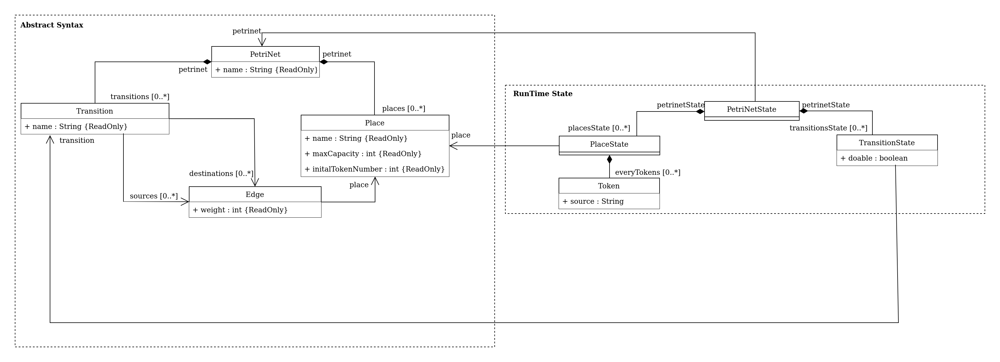
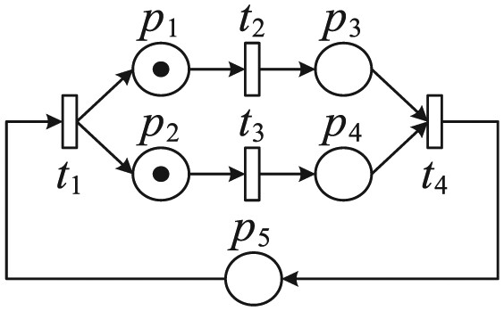

# Petri-Nets
Creation of a Petri net Domain-Specific Language. Uses Langium.

## Requirements
* Node.js
* TypeScript
* Langium
* Jest

## Project's syntax

  

## Examples

* test1.PetriNet

  

* test2.PetriNet

  

