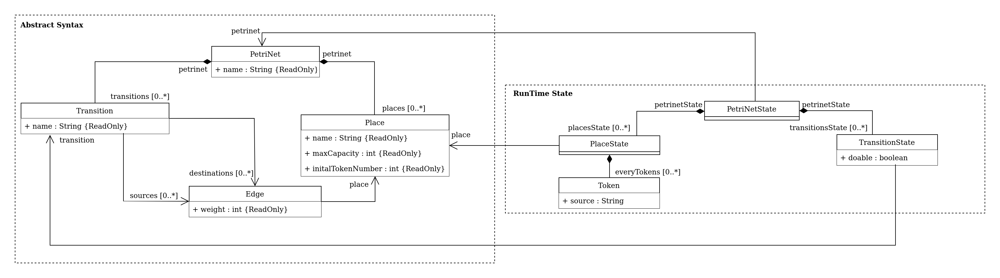

# Petri-Nets
Creation of a Petri net Domain-Specific Language. Uses Langium.

## Requirements
* Node.js
* TypeScript
* Langium
* Jest
* Commander

## Project's syntax
<p align="center">
  
</p>

## Command Lines
After having debugged the project once, start your command with :
```
node out/main.js
```
Followed by :

* ``` run <number>``` : Run a server to a specific port
* ``` generate``` : Generate a PetriNet file, have options.
  - ``` generate --places <number>``` : Generate a PetriNet file with a specific number of places
  - ``` generate --places <number>:<number>``` : Generate a PetriNet file with a random number of places between a minimum and a maximum

## Generator
This project can generate files in the folder *examples* using the dedicated command line, i.e. **Command Lines**.

## Examples
* test1.PetriNet
<p align="center">
  
</p>

* test2.PetriNet
<p align="center">
  
</p>
